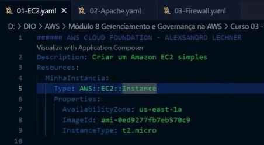
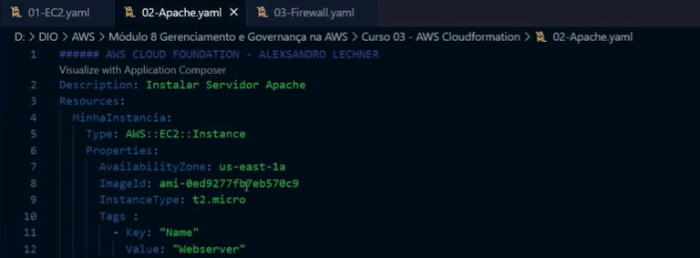
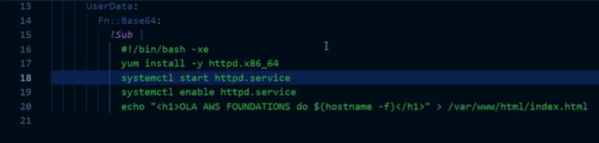
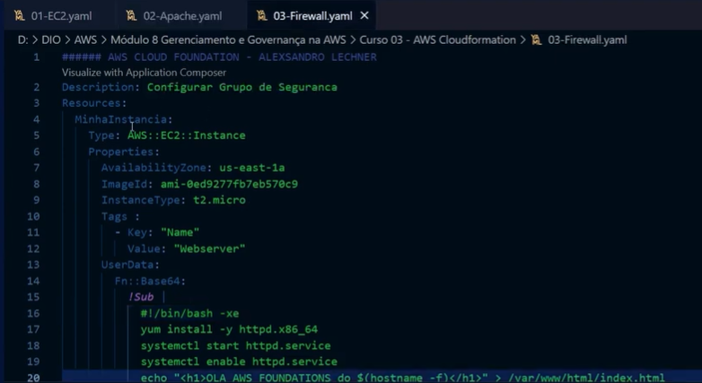
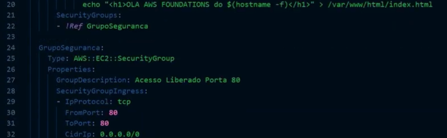

# # Laboatorio 03

Neste Arquivo esta documentado meus aprendizados e insights relacionado a AWS CloudFormation.

## ⚙️ AWS Cloud Formation

É um processo que auxilia na automação de criação de recurso na AWS por meio de templates JSON ou YAML.

Os templates podem ser utilizados inumeras vezes e somente é pago pelas stacks criadas (conjunto de recursos, ex: EC2, RDS, S3, etc).

Esses templates podem ser utilizados para criar e gerenciar os meu recursos na AWS.

 

# # Código

1 - Criação de instancia EC2

2 - Criação de Apache

3 - Criação/Configuração Firewall

---
 
 

🧩 Documentação AWS CloudFormation
---
**What is AWS CloudFormation?** 
https://docs.aws.amazon.com/AWSCloudFormation/latest/UserGuide/Welcome.html

