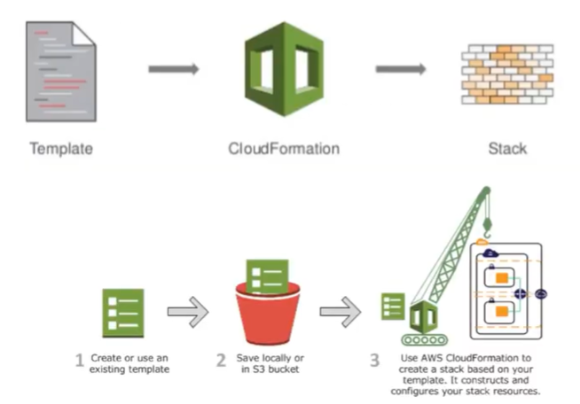

# # Laboatorio 04

Neste Arquivo esta documentado meus aprendizados e insights relacionado a AWS CloudFormation.


## ⚙️ AWS Cloud Formation: Infrastructure As Code (IaC)

CloudFormation é um serviço que facilita a modelagem e configuração de recursos na AWS. Com ele são criados modelos que descrevem os recursos necessarios, como EC2 ou banco de dados RDS, automatizando o provisionamento e configuração

Com ele não tem a necessidade de comfigurar recursos manualmente, permitindo o foco no desenvolvimento e gestao dos aplicativos

<br>

Beneficios:
* **Automação:** O AWS Cloudformation ajuda a automatizar o processo de criação, configuração e gerenciamento de recursos na AWS. Isso permite que a infraestrutura seja implantada de forma rapida, confiavel e repetida.
* **Consistencia e Padronização:** Com o AWS CloudFormation, é possivel criar modelos padrão de pilhas de infraestrutura que podem ser usados para criar copias identicas da mesma infraestrutura. Isso garante consitencia na implantação da infraestrutura e facilita a manutenção.
* **Economia de Custos:** O AWS Cloudformation ajuda a reduzir custos permitindo que os clientes usem modelos de infraestrutura existentes e os reutiliem em varios ambientes. isso reduz o custo de projetar e implementar uma nova infraestrutura.
* **Segurança:** Ajuada a garantir que todos os recursos da AWS sejam configurados com segurança usando politicas e regras de segurança.Isso ajuda a proteger a infraestrutura de potenciais ameaças a segurança.

<br>

1- Arquitetura Cloud Formation



---
<br>
<br>

Ele suporta JSON e YAML como formatos para criação dos templates.


# # Formato JSON 

```json
{
  "Resources": {
    "MyInstance": {
      "Type": "AWS::EC2::Instance",
      "Properties": {
        "InstanceType": "t2.micro",
        "ImageId": "ami-12345678"
      }
    }
  }
}
```

# # Formato YAML

```yaml
Resources:
  MyInstance:
    Type: "AWS::EC2::Instance"
    Properties:
      InstanceType: "t2.micro"
      ImageId: "ami-12345678"

```


---
<br>
<br>

🧩 Documentação AWS Step Functions
---
**What is AWS CloudFormation?** 
https://docs.aws.amazon.com/AWSCloudFormation/latest/UserGuide/Welcome.html


